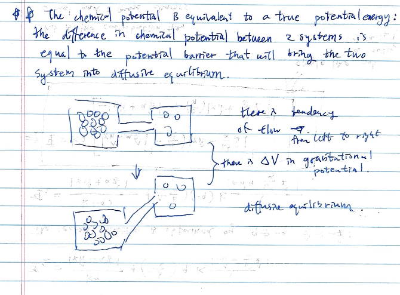

Heat flows from higher temperature to lower temperature. Particles flow from higher chemical potential to lower chemical potential.

ex: battery with electrons

diffusive contact: can exchange heat and particles

# derivation of chemical potential written in helmholtz free energy

(reminder) Helmholdz free energy: $F = U - \tau \sigma$ will be a minimum for a system in thermal equilibrium

Then use consider two systems at thermal equilibrium

$$F = F_1 + F_2 = U_1 + U_2 - \tau (\sigma_1 + \sigma_2)$$

demand conservation of particle number $N = N_1 + N_2$, $dN_1 + dN_2 = 0$, and that helmholtz free energy at minimum $dF = 0$

The infinitesmal change of $F$ is

$$dF = \left(\frac{\partial F_1}{\partial N_1}\right)_\tau dN_1 +  \left(\frac{\partial F_2}{\partial N_2}\right)_\tau dN_2 = 0$$

when combined with $dN_1 + dN_2 = 0$, it gives

$$\left(\frac{\partial F_1}{\partial N_1}\right)_\tau =  \left(\frac{\partial F_2}{\partial N_2}\right)_\tau$$

which facilitates the definition $\mu(\tau, V, N) = \left( \frac{\partial F}{\partial N} \right)_{\tau, V}$

This facilitates the formulation diffusive equilibrium in chemical potential in analogy with thermal equilibrium in temperature. 

***THE CHEMICAL POTENTIAL IS EQUIVALENT TO A TRUE POTENTIAL ENERGY!***

